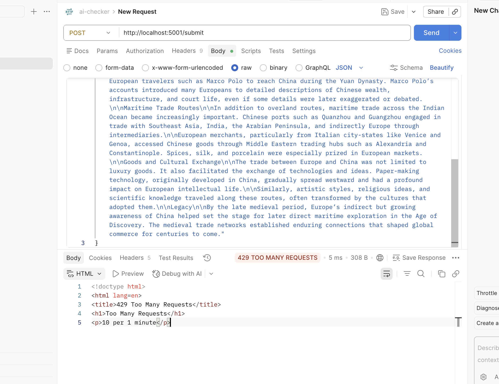

## Signals
The signals we will use are: stylometric hueristics and ml model predicting. 

### Digital tracing-watermark detection:

This is a detection method which is based on the assumption that ai uses certain unicode/ascii characters that humans would not use due to it being invisble to human being. 

### Classical Classification ML Models:

The ml models are trained on patterns and stylometric scores of ai vs human text. Hence, they measure patterns and stylometric features of text to predict if it is ai generated or not. Two algorithms are used: CNN and decision tree. 

### Stylometric Heuristics:

The stylometric heuristics are features of text that are known to be different between ai and human generated text in terms of uniformity, punctuation density and sentence structure. 


# AI Text Detector — REST API

A Flask-based REST API that attributes text content as AI-generated or human-written using an ensemble of a CNN and Random Forest classifier, with confidence scoring, rate limiting, an appeals workflow, and a full audit log.

---

## Quick Start

```bash
# 1. Activate the virtual environment
python3.11 -m venv venv
source venv/bin/activate

# 2. Install dependencies
pip install -r requirements.txt
python -m spacy download en_core_web_sm

# 3. Start the server (models load on startup — expect ~15–20 s)
python app.py
```

The server listens on `http://localhost:5000`.

---

## API Reference

### `POST /submit`

Submit a piece of text for attribution analysis.

**Request**
```json
{
    "creator_id": "user-123",
    "text": "Your poem, story excerpt, or blog post goes here..."
}```

- `text` must be a non-empty string of at least 20 words.

**Response `200`**
```json
{
    "confidence_score": 100,
    "creator_id": "user0233",
    "result": "failed",
    "submission_id": "58a4cc6f-e141-4f4e-a0f3-75df387d4e04",
    "transparency_label": "High-confidence AI-generated",
    "warning_report": {
        "digital_trace_report": {
            "ascii_traces": 0,
            "nnbsp_traces": 0,
            "regular_traces": 0,
            "verdict": "green"
        },
        "stylometric_report": {
            "ai_phrase_count": 0,
            "ai_phrases_found": [],
            "avg_sent_len": 21.2,
            "score": 35,
            "sent_len_stdev": 6.5,
            "sentence_count": 20,
            "type_token_ratio": 0.548,
            "word_count": 425
        }
    }
}

```


**Error responses**

| Status | Cause |
|--------|-------|
| 400 | Missing or empty `text` field |
| 422 | Fewer than 20 words |
| 429 | Rate limit exceeded |
| 503 | Models still loading |

Rate limit evidence:


429 TOO MANY REQUESTS:

<!doctype html>
<html lang=en>
<title>429 Too Many Requests</title>
<h1>Too Many Requests</h1>
<p>10 per 1 minute</p>

---

### `POST /appeal/<submission_id>`

Contest a classification decision. The submission status is updated to `under_review` and the creator's reasoning is logged.

**Request**
```json
{ "reasoning": "This poem was written by hand over three drafts…" }
```

**Response `201`**
```json
{
  "appeal_id": "f9e8d7c6-…",
  "submission_id": "a1b2c3d4-…",
  "appealed_at": "2026-06-28T10:05:00+00:00",
  "status": "under_review",
  "message": "Your appeal has been received. The submission is now under review."
}
```

**Error responses**

| Status | Cause |
|--------|-------|
| 400 | Missing or empty `reasoning` field |
| 404 | `submission_id` not found |

Bad response: 

{
"error": "Request body must contain 'text' and 'creator_id'."
}

---

### `GET /log`

Return the full structured audit log. Each entry includes the original decision (confidence score and model signals) plus any associated appeals.

**Query parameters**

| Param | Default | Description |
|-------|---------|-------------|
| `limit` | 100 | Max entries to return (capped at 500) |
| `offset` | 0 | Skip N entries (pagination) |

**Response `200`**
```json
{
    "confidence_score": 100,
    "creator_id": "user0233",
    "result": "failed",
    "submission_id": "58a4cc6f-e141-4f4e-a0f3-75df387d4e04",
    "transparency_label": "High-confidence AI-generated",
    "warning_report": {
        "digital_trace_report": {
            "ascii_traces": 0,
            "nnbsp_traces": 0,
            "regular_traces": 0,
            "verdict": "green"
        },
        "stylometric_report": {
            "ai_phrase_count": 0,
            "ai_phrases_found": [],
            "avg_sent_len": 21.2,
            "score": 35,
            "sent_len_stdev": 6.5,
            "sentence_count": 20,
            "type_token_ratio": 0.548,
            "word_count": 425
        }
    }
}

```

---

## Confidence Scoring

### How it works

Each submission passes through two independent classifiers:

| Model | Architecture | Output |
|-------|-------------|--------|
| CNN | Conv1D → Dense → Sigmoid | probability ∈ [0, 1] |
| Random Forest | 100 trees, Gini criterion | probability ∈ [0, 1] |

The **ensemble score** ensemble_prob =
0.75 * cnn +
0.25 * rf

The main signal will be combined like this:
ML Model score: 0.75 weightage for the CNN's score and 0.25 weigtage for the random forest's score. So, ensemble will be 0.75*CNN + 0.25*RF.

Output: score 0-100 where 0 = certainly human, 100 = certainly AI.
A false positive (labeling a human's work as AI-generated) is worse than a false negative on a writing platform.

Verdict will be a "AI generated" if the final score is 80 and above. If the score is 79 and below it will be marked as "Human generated". If the score is 75 from the classical models and the digital trace comes out as red then we mark the verdict as "AI generated" despite the score being 75. 

The warning section will have the report from the digital trace(if the signal is red) and the stylometric analysis(if the signal is failing). The stylometric analysis will otherwise not show up. 

###  Transparency labels:


| Transparency Label                  | When shown                                                    | Decision logic                                                     | Purpose                                                                                   |
| ----------------------------------- | ------------------------------------------------------------- | ------------------------------------------------------------------ | ----------------------------------------------------------------------------------------- |
| **High-confidence AI-generated**    | The detector is confident the content is AI generated.        | Ensemble score ≥ 80 OR ensemble score ≥ 75 AND Digital Trace = Red | Used only when multiple signals strongly indicate AI-generated content.                   |
| **High-confidence human-generated** | The detector is confident the content was written by a human. | Ensemble score < 25 AND Digital Trace = Green                      | Prevents false positives by requiring both a very low ML score and no watermark evidence. |
| **Uncertain**                       | Evidence is mixed or insufficient.                            | Any other combination of scores.                                   | Indicates that neither AI nor human authorship can be stated with high confidence.        |


### Why these thresholds are meaningful

The thresholds are asymmetric around 50 and intentionally coarser near the boundary. A score of 51 falls in **"Uncertain — could be AI or human"** with `confidence ≈ 0.02`, clearly distinguishable from a score of 80 (**"Likely AI-generated"**, `confidence = 0.60`) or 95 (**"Almost certainly AI-generated"**, `confidence = 0.90`). No label crosses the attribution boundary (human vs. AI) — a score of 49 and 51 both live in the "Uncertain" zone, preventing the label from asserting a confident verdict where none exists.

---

## Rate Limiting

**Limits on `POST /submit`:**

| Window | Max requests |
|--------|-------------|
| Per minute | 10 |
| Per hour | 50 |

**Rationale:** Feature extraction with spaCy + TextDescriptives and two model inferences takes roughly 1–3 seconds per request on a CPU. Ten requests per minute respects the server's compute budget while allowing a single user to do meaningful interactive testing. The hourly cap of 50 prevents sustained automated abuse without requiring authentication. Both limits apply per client IP address. A `429 Too Many Requests` response is returned when exceeded.

---

## Audit Log

Every attribution decision is stored in a local SQLite database (`audit.db`) with the following schema:

**`submissions` table**

| Column | Type | Description |
|--------|------|-------------|
| `id` | TEXT PK | UUID |
| `submitted_at` | TEXT | ISO-8601 UTC timestamp |
| `text_preview` | TEXT | First 200 characters |
| `word_count` | INTEGER | Word count |
| `cnn_score` | REAL | CNN model score (0–100) |
| `rf_score` | REAL | Random Forest score (0–100) |
| `ensemble_score` | REAL | Average of both (0–100) |
| `attribution` | TEXT | `"ai"` or `"human"` |
| `confidence` | REAL | Distance from boundary (0–1) |
| `transparency_label` | TEXT | User-facing label |
| `status` | TEXT | `"decided"` or `"under_review"` |

**`appeals` table**

| Column | Type | Description |
|--------|------|-------------|
| `id` | TEXT PK | UUID |
| `submission_id` | TEXT FK | References `submissions.id` |
| `appealed_at` | TEXT | ISO-8601 UTC timestamp |
| `creator_reasoning` | TEXT | Creator's written reasoning |

The `GET /log` endpoint surfaces a live view of both tables joined, with appeals nested under their parent submission.

### Sample log output (3 entries)

```json
{
  "total_returned": 3,
  "entries": [
    {
      "submission_id": "c3d4e5f6-…",
      "submitted_at": "2026-06-28T10:12:00+00:00",
      "text_preview": "Furthermore, it is important to note that in conclusion…",
      "word_count": 89,
      "signals": { "cnn_score": 94.1, "rf_score": 88.7, "ensemble_score": 91.4 },
      "attribution": "ai",
      "confidence": 0.828,
      "transparency_label": "Almost certainly AI-generated",
      "status": "decided",
      "appeals": []
    },
    {
      "submission_id": "a1b2c3d4-…",
      "submitted_at": "2026-06-28T10:08:00+00:00",
      "text_preview": "The morning light crept through the shutters, slow and certain…",
      "word_count": 142,
      "signals": { "cnn_score": 82.3, "rf_score": 76.1, "ensemble_score": 79.2 },
      "attribution": "ai",
      "confidence": 0.584,
      "transparency_label": "Likely AI-generated",
      "status": "under_review",
      "appeals": [
        {
          "appeal_id": "f9e8d7c6-…",
          "appealed_at": "2026-06-28T10:09:00+00:00",
          "creator_reasoning": "This poem was written entirely by hand over three drafts. I have the original handwritten pages."
        }
      ]
    },
    {
      "submission_id": "b2c3d4e5-…",
      "submitted_at": "2026-06-28T10:01:00+00:00",
      "text_preview": "She pressed her palm against the cold glass and waited…",
      "word_count": 210,
      "signals": { "cnn_score": 21.4, "rf_score": 18.9, "ensemble_score": 20.2 },
      "attribution": "human",
      "confidence": 0.596,
      "transparency_label": "Likely human-written",
      "status": "decided",
      "appeals": []
    }
  ]
}
```

---

## Project Structure

```
ai_text_detector/
├── app.py                  ← Flask REST API (this service)
├── predict.py              ← CLI inference tool
├── train.py                ← Model training pipeline
├── requirements.txt
├── audit.db                ← SQLite audit log (auto-created)
└── models/
    ├── cnn_final.keras
    ├── rf.joblib
    ├── scaler.joblib
    └── feature_cols.joblib
```


## AI Usage:

### Instance #1

What human directed AI to do: write the signal for ai detection: stylometric measures 

What ai did: wrote the code for both watermark detection and stylometric detection. watermark detection was already implmented. the duplicated it in this new file instead of calling it from an import. 

What I did instead: I refactored the duplication. 

### Instance #2

What human directed AI to do: write application that gives a score and loads the models to generate the score. 

What ai did: wrote the code that loads the models despite the code existing already in a file.  

What I did instead: I refactored the duplication. 


## Known Limitations

The limitations can be specified by signal.

Watermark signal relies on certain unicode characters or ascii characters which are unperceptable to humans. Now, typographers use these characters and so there is no guarentee that only ai generates such characters. Even if the content is ai generated it is very trivial to fix these watermarks with a simple search and replace. 

Also, certain watermarks are restricted only to certain models.  

So, both false positives and false negatives are possible. 

The stylometric detection and the ml model prediction which are both ultimately relying on text patterns of humans vs ai both have the problem that they rely on certain patterns which may not pan out in all cases. 

Content written by humans (eg. content written by well educated professors) can sometimes have the same patterns and some human text has the same cadence, uniformity as ai generated text. This will result in false positives. 

So content written by professionals on certain bland topics can sometimes be labelled as ai generated. 


## Spec reflection 

I planned to have two signals which are complimentary(stylometric measures and ml model prediction) But ended up with three with the watermark-digital tracing detection being genuinely complimentary with the other two but the other two relying on the same underlying principle. 

During the implementation I had also clubbed the digital trace detection and stylometric together since they don't have heavy processing but later decided that they pretty distinct approaches and need to have their own category. 


## Architecture Overview

The API processes every submission through a multi-stage attribution pipeline.

                +----------------+
                | POST /submit   |
                +-------+--------+
                        |
                        v
              Input Validation
                        |
                        v
          Feature Extraction (spaCy +
            TextDescriptives metrics)
                        |
                        +--------------------+
                        |                    |
                        v                    v
                 CNN Classifier      Random Forest
                        |                    |
                        +---------+----------+
                                  |
                    Weighted Ensemble
                  (75% CNN, 25% RF)
                                  |
                                  v
                     Digital Trace Detection
                                  |
                                  v
                    Stylometric Heuristics
                                  |
                                  v
               Verdict + Confidence Score
                                  |
                                  v
              Transparency Label Generation
                                  |
                                  v
               SQLite Audit Log Storage
                                  |
                                  v
                  JSON API Response